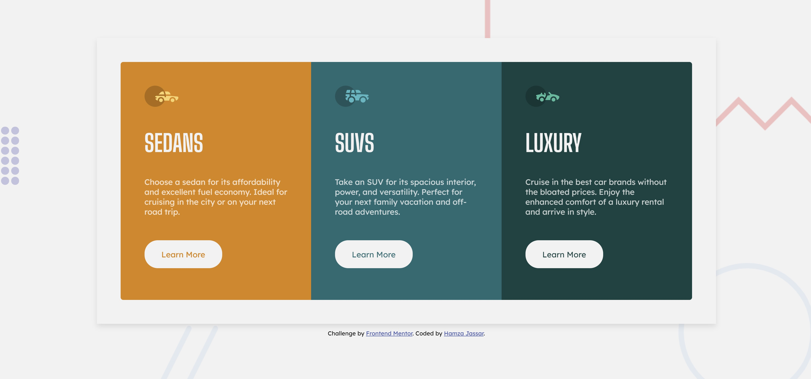
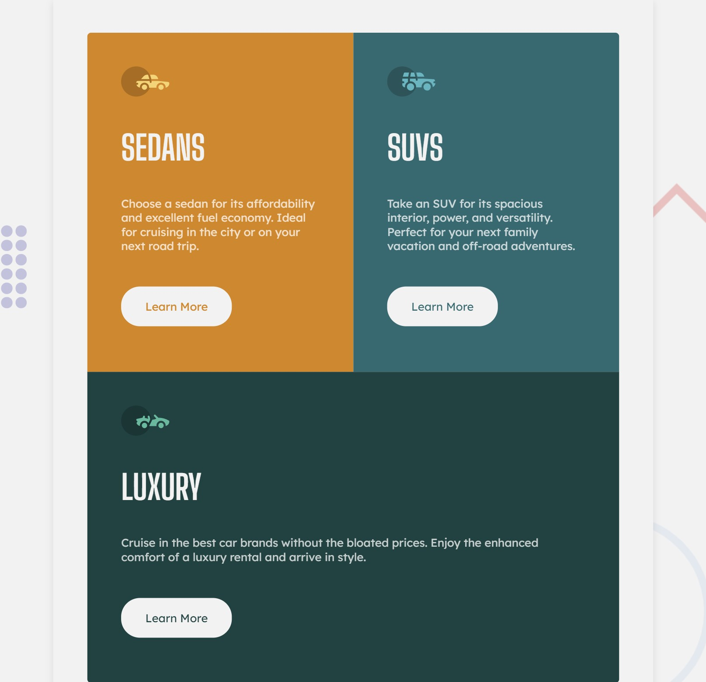
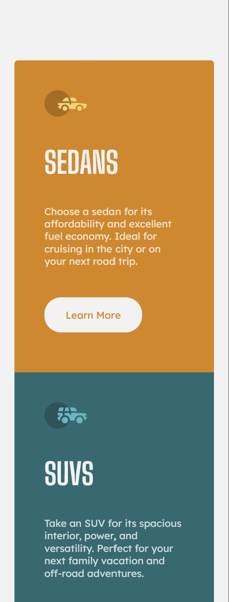
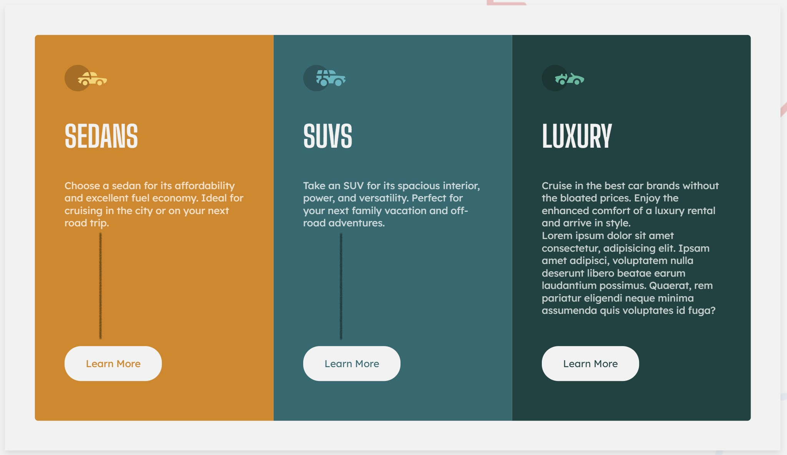

# Frontend Mentor - 3-column preview card component solution

This is a solution to the [3-column preview card component challenge on Frontend Mentor](https://www.frontendmentor.io/challenges/3column-preview-card-component-pH92eAR2-). Frontend Mentor challenges help you improve your coding skills by building realistic projects. 

## Table of contents

- [Overview](#overview)
  - [The challenge](#the-challenge)
  - [Screenshot](#screenshot)
  - [Links](#links)
- [My process](#my-process)
  - [Built with](#built-with)
  - [What I learned](#what-i-learned)
  - [Continued development](#continued-development)
  - [Useful resources](#useful-resources)
- [Author](#author)

**Note: Delete this note and update the table of contents based on what sections you keep.**

## Overview

### The challenge

Users should be able to:

- View the optimal layout depending on their device's screen size
- See hover states for interactive elements

#### **Bonus Challenge** 🎁

I added a few features to make it more interesting

- Flexibility for an infinite amount of cards and rows.
- Dynamic update of the card corners depending on the card's position in the row, and the row's position in the page.
- Use of canvas to draw the background elements.

### Screenshots

Desktop view


Tablet View


Mobile View


<br/>


### Links


- Live Site URL: [Here](https://fem-3column-preview.herokuapp.com/)

## My process

### Built with

- Semantic HTML5 markup
- CSS custom properties
- JavaScript
- Flexbox

### What I learned

- While convenient, flex inside a flex inside a flex can get a little bit confusing. A more readable approach can be considred and eliminating Flexbox where not needed is best.
- In [this video](https://www.youtube.com/watch?v=txVDe3pKoxE), I use JavaScript to make the heights of paragraphs equal. I used this approach to help a client fix one of their pages. In this challenge, I upgraded the approach a bit; I figured out how to detect the number of cards in each row.
```js
const cards = document.querySelectorAll('.card')

  const cardRows = [[]]
  let controlTop = cards[0].getBoundingClientRect().top;

  cards.forEach(card => {
      // Check if current Card is aligned with the previous card, if not, create a new row
      const cardTop = card.getBoundingClientRect().top;
      if (cardTop === controlTop) cardRows[cardRows.length - 1].push(card)
      if (cardTop > controlTop) {
          cardRows.push([])
          cardRows[cardRows.length - 1].push(card)
      }
      controlTop = cardTop;
  })
```
Such approach gives more control in ***adjusting the heights*** of the cards, or their paragraphs, and allows the buttons to be aligned regardless of the length of the text.
```js
  const cardParagraph = card.querySelector('.card__paragraph')
  cardParagraph.style.height='fit-content'
  if (cardParagraph.offsetHeight > controlHeight) controlHeight = cardParagraph.offsetHeight
```


It also allows for ***dynamic corners*** depending on the card's position within the row, and the position of the card itelf.

The SUVS card for example, has a sharp upper-right corner, but when the window becomes tighter (e.g. in tablets), the SUVS card becomes the last one in the row and the upper-right corner adjusts accordingly.


### Continued development
#### **Refactoring**
For this particular project, some refactoring needs to be done especially in CSS. I started without the `#wrapper` then introduced that afterwards to accommodate for the attribution, so some lines are redundant.

#### **Performance**
The approach of going through the DOM multiple times to compare and adjust is definitely problematic if more and more cards are introduced to the page and does not seem to be a good approach in terms of performance.

Using JavaScript to determine the structure before rendering it sounds like a better approach, which is where componenets would serve

#### **Colors**
For the canvas elements, I used [Instant Eyedropper](http://instant-eyedropper.com), the actual color with a decimal alpha is a better approach. Considering my [protanomaly](https://en.wikipedia.org/wiki/Color_blindness), this shortcut is quicker for me.

### Useful resources

- [Changing image size in markdown](https://stackoverflow.com/questions/14675913/changing-image-size-in-markdown) - This was helpful for exactly that 😀.
- [lineCap](https://developer.mozilla.org/en-US/docs/Web/API/CanvasRenderingContext2D/lineCap) and [lineJoin](https://developer.mozilla.org/en-US/docs/Web/API/CanvasRenderingContext2D/lineJoin) - Useful for the Canvas lines in the Background to give them the "round" feel.
- 🔌 Plugging [another video of mine](https://www.youtube.com/watch?v=t1xFzqxYS4g), sorry 😅 - I used the same approach to create multiple rows of *beads* in the background using [Template strings](https://developer.mozilla.org/en-US/docs/Web/JavaScript/Reference/Template_literals). This keeps the HTML file clean and allows you to create as many rows as you need simply changing one line (`const numOfBeads = 6`).

## Author

I am a self-taught full stack developer!

<!-- - Website - [CNSPLIT](https://cnsplit.com/) -->
- Frontend Mentor - [@HJassar](https://www.frontendmentor.io/profile/HJassar)
- [YouTube Channel](https://www.youtube.com/channel/UCgqsUFsHUMT5bX3BjtTX2fA)
